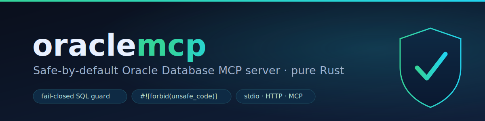

<p align="center">
  
</p>

<p align="center">
  <a href="https://github.com/MuhDur/oraclemcp/actions/workflows/ci.yml"></a>
  <a href="https://crates.io/crates/oraclemcp"></a>
  <a href="#license"></a>
  
  
</p>

> **Governed, least-privilege Oracle Database access for AI agents — in pure Rust.**

`oraclemcp` is a [Model Context Protocol](https://modelcontextprotocol.io) server that gives an AI agent governed, least-privilege access to an Oracle database: schema introspection, DDL, compile errors, source search, ad-hoc read queries, plan analysis, and an explicit profile-gated execution path for non-read SQL. Every raw statement the agent submits is classified *before* it can reach Oracle. Read tools only admit statements proven read-only; `oracle_execute` only runs statements permitted by the active profile/session level, rolls DML back by default, and requires a preview-derived execution grant before commit. Session elevation is explicit, temporary, and capped by profile `max_level`. The core is engine-free and `#![forbid(unsafe_code)]`.

> _An independent open-source project; not affiliated with Oracle. For Oracle's own MCP servers, see [oracle/mcp](https://github.com/oracle/mcp)._

## Install, service, dashboard

One line installs or updates `oraclemcp` on macOS and Linux. It works as pasted
for a human terminal and for a non-interactive agent run:

```sh
curl -fsSL "https://raw.githubusercontent.com/MuhDur/oraclemcp/main/install.sh?$(date +%s)" | bash -s -- --version 0.6.3
```

The hosted script fetch includes a cache buster so stale CDN/proxy copies do not
hide installer updates. This command is literal and copy-pasteable for release
`0.6.3`; change only the version number when installing another release. Later
examples that contain `...`, `<pw>`, `<profile>`, or placeholder env values are
templates: replace those placeholders before running them.

The normal command downloads, verifies, and installs into `$HOME/.local` unless
you pass `--prefix`. It requires the SHA-256 digest check, verifies the cosign
blob signature and provenance attestation when cosign is installed, and installs
`oraclemcp` plus the short `om` alias. Missing cosign is a visible
authenticity-unverified posture by default; use `--verify require` when your
environment requires cosign to be present.

In an interactive terminal, the installer then offers a short guided flow:
append the binary directory to `PATH`, run `doctor`, print an MCP client snippet,
and optionally install the loopback service. In a pipe, CI job, or agent run, it
never prompts and never starts a service; it installs the binary and prints the
exact `PATH` line plus next steps on stderr. Every install finishes with next
steps on stderr: run `doctor`, write the starter profile, and generate MCP
client snippets.

Re-running the same one-liner is the update path. Re-running the same verified
archive is a no-op for identical installed files; re-running with a newer target
updates atomically after backing up the previous binary. A downgrade is refused unless you pass `--force`.

Use the dry-run command first when you want a preview: it prints the archive,
verification inputs, files, service plan, client-registration plan, and
installer lock path, then exits before downloading, verifying, writing files, or
touching the service manager. Dry-run exists for review and automation plans;
the normal command above is the install/update command.

### Advanced install paths

Preview the Linux/macOS host plan without changing the machine:

```sh
curl -fsSL "https://raw.githubusercontent.com/MuhDur/oraclemcp/main/install.sh?$(date +%s)" | bash -s -- --dry-run --version 0.6.3
```

From an installed binary, preview or run the same update path:

```sh
oraclemcp --json self-update --dry-run --version 0.6.3
oraclemcp self-update --version 0.6.3 --no-service
```

On Windows, download and run the PowerShell installer:

```powershell
iwr -UseBasicParsing https://raw.githubusercontent.com/MuhDur/oraclemcp/main/install.ps1 -OutFile install.ps1
powershell -ExecutionPolicy Bypass -File .\install.ps1 -DryRun -Version 0.6.3
powershell -ExecutionPolicy Bypass -File .\install.ps1 -Version 0.6.3
```

The Windows installer accepts the same release operations: `-Update` for the
explicit update path, `-NoService` to suppress service prompts, and
`-Verify prefer`, `-Verify require`, or `-Verify checksum-only` for the
verification posture. `prefer` installs after a hard SHA-256 check when cosign
is missing; `require` fails without cosign.

```powershell
powershell -ExecutionPolicy Bypass -File .\install.ps1 -Update -Version 0.6.3 -NoService
```

For air-gapped hosts, download the release archive plus its `.sha256`, `.sig`,
`.crt`, and `.attestation.sigstore.json` siblings, then run a downloaded copy
of the installer:

```sh
bash install.sh --offline ./oraclemcp-x86_64-unknown-linux-musl.tar.gz --version 0.6.3
```

```powershell
powershell -ExecutionPolicy Bypass -File .\install.ps1 `
  -Offline .\oraclemcp-x86_64-pc-windows-msvc.zip -Version 0.6.3
```

The release installer does not silently fall back from a missing release archive
to a source build. Use `--source` explicitly when you want `cargo install`
instead of the verified archive path.

Uninstall is preview-first and idempotent. Service removal remains an explicit
service-manager mutation:

```sh
bash install.sh --uninstall --dry-run
bash install.sh --uninstall --yes
bash install.sh --uninstall --service --yes
```

```powershell
powershell -ExecutionPolicy Bypass -File .\install.ps1 -Uninstall -DryRun
powershell -ExecutionPolicy Bypass -File .\install.ps1 -Uninstall -Yes
```

Install the local service only with explicit consent. Keep it on loopback unless
you deliberately configure remote HTTP, and use service-owned client credentials,
OAuth, or mTLS for HTTP MCP clients. For Windows service install, the PowerShell
installer also requires explicit consent.

```sh
oraclemcp --json service install --dry-run --profile db_ro --listen 127.0.0.1:7070 --client-credentials
oraclemcp service install --yes --profile db_ro --listen 127.0.0.1:7070 --client-credentials
oraclemcp --json clients issue --label claude --scope oracle:read
```

```powershell
powershell -ExecutionPolicy Bypass -File .\install.ps1 -Service -Yes -Profile db_ro
```

Open the operator dashboard through the paired browser flow:

```sh
om dashboard
```

The dashboard uses a one-time loopback pairing ticket, then an HttpOnly
SameSite=Strict cookie plus CSRF and route-scoped action tickets. Browser
requests do not supply the database Subject: the server derives the Subject from
the authenticated transport principal, session, and lane context. Authenticated
HTTP sessions run on isolated per-principal lanes with their own Oracle
connection, operating level, grants, cancellation, and audit context. Intentional
`--allow-no-auth` HTTP development uses one anonymous lane; stdio remains the
single local client path.

Other release channels come from the same signed archive matrix. These channels
can lag the GitHub release tag, so use the check command first and install only
after it resolves the target version.

```sh
cargo binstall oraclemcp
docker run -i --rm ghcr.io/muhdur/oraclemcp:0.6.3
```

Pending registry-backed channels:

```sh
brew info MuhDur/oraclemcp/oraclemcp
winget search --id MuhDur.oraclemcp --exact
npm view oraclemcp@0.6.3 version
```

After the relevant check resolves the target version, these commands are
copy-pasteable:

```sh
brew install MuhDur/oraclemcp/oraclemcp
winget install --id MuhDur.oraclemcp --exact
npx oraclemcp serve --profile db_ro --allow-no-auth
```

The npm wrapper is a verify-before-run package with no `postinstall` mutation.
It checks SHA-256 before running the binary and soft-skips cosign in the default
`prefer` posture when cosign is not installed; set `ORACLEMCP_NPM_VERIFY=require`
to require cosign.

## Why oraclemcp

- **Fail-closed by construction.** A SELECT that an agent dreams up should never silently turn into a `DELETE`. Each raw statement runs through the hardened classifier. Read tools admit only **proven** read-only `SELECT`/`WITH` and dictionary introspection. Non-read execution is isolated in `oracle_execute`, bounded by profile `max_level`/`default_level`, rollback-by-default for DML, and explicit-confirm-before-commit. Temporary elevation through `oracle_set_session_level` can never exceed the profile ceiling. *Forbidden* constructs (multi-statement batches, string-concat dynamic SQL, an unproven function call inside a SELECT) are rejected before touching the database, with an `OperatingLevelTooLow` or `ForbiddenStatement` envelope and a suggested safe alternative.
- **Agent-first UX.** Every tool ships a real JSON Schema, title, and explicit MCP annotations (`readOnlyHint`, `destructiveHint`, `idempotentHint`, `openWorldHint`) so clients do not infer unsafe defaults. Errors are structured [`ErrorEnvelope`](crates/oraclemcp-error)s with machine-stable classes, fuzzy suggestions, and next-step hints, not bare strings. A zero-arg `oracle_capabilities` tool lets an agent discover the surface; MCP resources expose the capability/tool documents plus schema/object read templates; and an offline build degrades to a `RuntimeStateRequired` contract instead of crashing.
- **Pure Rust, no `unsafe`.** Every crate is `#![forbid(unsafe_code)]`; the fail-closed classifier carries a differential cargo-fuzz target.
- **Two transports.** stdio (default) and Streamable HTTP (`--listen`) with
  fail-closed auth defaults, optional OAuth bearer enforcement, and native
  rustls TLS/mTLS.

## Source builds and runtime requirements

This branch is pinned to **`nightly-2026-05-11`**. The thin-native line has no
stable MSRV because **asupersync 0.3.4** uses nightly-only language features
(`#![feature(try_trait_v2)]` and `try_trait_v2_residual`); the pinned `oracledb`
0.5.1 driver itself is stable-clean. The repository's `rust-toolchain.toml`
selects the pin for local builds. Use the release installer above when you want
the prebuilt binary; use `cargo install` only when you intentionally want a
source build.

```sh
rustup toolchain install nightly-2026-05-11 --component rustfmt --component clippy
```

Direct source install:

```sh
cargo +nightly-2026-05-11 install oraclemcp
```

Live database access is built in through the pure-Rust thin `oracledb` driver.

**Runtime requirements** for live database access:

- Optionally `TNS_ADMIN` pointing at a directory with `tnsnames.ora` if you connect by net-service name.

No Oracle Instant Client, ODPI-C library, or C toolchain is required by the
driver.

Use `oraclemcp --json doctor` to verify the binary and offline setup,
`oraclemcp --json doctor --profile <profile>` to inspect non-secret profile
metadata without resolving secrets, and
`oraclemcp --json doctor --online --profile <profile>` to add live
connectivity, authentication, role/open-mode, standby, and privilege checks.
Doctor output is safe to paste into agent sessions: it omits connect strings,
usernames, `credential_ref` values, passwords, proxy identities, wallet
passwords, IAM tokens, wallet paths, and server DNs while keeping structured
failure classes and ORA codes visible.

Generate generic local setup templates for profiles, wrappers, and MCP client
snippets:

```sh
oraclemcp --json setup --profile db_ro
```

To create a minimal starter profiles file directly, use the same config-ops
backend the dashboard uses. This validates the draft, writes a backup,
atomically replaces the target, and reports the reload/rollback metadata
without echoing the raw profile TOML:

```sh
oraclemcp --json setup --write --profile db_ro
```

**Docker:** a ready-to-run thin-driver image, published to GHCR and listed in the [MCP registry](https://registry.modelcontextprotocol.io) on release as `io.github.MuhDur/oraclemcp`. Mount a profiles config and pass the credential the profile's `credential_ref` expects:

```sh
docker run -i --rm \
  -v "$HOME/.config/oraclemcp:/root/.config/oraclemcp:ro" \
  -e ORACLE_APP_PASSWORD \
  ghcr.io/muhdur/oraclemcp:0.6.3          # MCP over stdio, against the configured profile

docker run -i --rm ghcr.io/muhdur/oraclemcp:0.6.3   # tool surface only (no DB)
```

An optional PL/SQL intelligence image is available from the manual Docker
workflow. It is the same server compiled with `--features plsql-intelligence`;
it can start without a database connection and advertises the offline
`oracle_plsql_*` tools immediately. Live PL/SQL tools still require a profile.

```sh
docker run -i --rm ghcr.io/muhdur/oraclemcp:0.6.3-plsql-intelligence --json info
docker run -i --rm ghcr.io/muhdur/oraclemcp:0.6.3-plsql-intelligence capabilities
```

Local feature-image builds resolve the PL/SQL engine crates from crates.io:

```sh
docker buildx build \
  --target runtime-plsql-intelligence \
  -t oraclemcp:plsql-intelligence .
docker run -i --rm oraclemcp:plsql-intelligence --json info
```

> The Docker image and crates are Apache-2.0 OR MIT and do not redistribute Oracle Instant Client.

Wire it into an MCP client (e.g. Claude Desktop) over stdio:

```json
{
  "mcpServers": {
    "oracle": {
      "command": "oraclemcp",
      "args": ["serve", "--profile", "db_ro", "--allow-no-auth"]
    }
  }
}
```

For Codex-style TOML config, the same command is:

```toml
[mcp_servers.oracle]
command = "oraclemcp"
args = ["serve", "--profile", "db_ro", "--allow-no-auth"]
```

Or run it directly:

```sh
oraclemcp serve                      # stdio (default); --allow-no-auth for local dev
oraclemcp --json clients issue --label claude --scope oracle:read  # shown-once HTTP bearer
oraclemcp serve --listen 127.0.0.1:7070 --client-credentials --profile db_ro
oraclemcp serve --listen 127.0.0.1:7070 --allow-no-auth   # local HTTP dev only
oraclemcp --json setup --profile db_ro    # generic onboarding templates
oraclemcp --json setup --write --profile db_ro  # write starter profiles via SCFG
oraclemcp capabilities               # the advertised tool surface + feature tiers (JSON)
oraclemcp --json profiles            # configured profile names and non-secret metadata
oraclemcp doctor                     # offline diagnostics (thin driver, TNS/wallet, classifier, NLS)
oraclemcp doctor --profile dev_ro    # inspect profile metadata offline
oraclemcp doctor --online --profile dev_ro  # include live connectivity/auth/role/privilege checks
oraclemcp info                       # build info: version, tools, transports, thin DB
oraclemcp robot-docs guide           # compact in-binary guide for agents
oraclemcp completions bash           # shell completions: bash, zsh, fish, powershell
oraclemcp --json service install --dry-run --profile db_ro  # preview systemd/launchd/Windows service changes
oraclemcp service install --yes --client-credentials --profile db_ro
oraclemcp --json service status       # inspect service-manager state
oraclemcp --json service logs         # inspect recent service logs
oraclemcp --json service backup --dry-run  # preview state+config backup
oraclemcp --json service restore /path/to/backup --dry-run  # verify audit chain before restore
oraclemcp dashboard                   # open the local dashboard through a one-time pairing URL
```

`--json` is a visible alias for `--robot-json` and keeps stdout as a single
machine-readable JSON object.

Release archives also include `om` (`om.exe` on Windows) as an argv0-aware
short alias. `om dashboard` is equivalent to `oraclemcp dashboard` and uses the
short name in CLI help and dashboard diagnostics when invoked through that
alias.

`oraclemcp service install` targets the platform user service manager: systemd
`--user` on Linux, launchd on macOS, and Windows services on Windows. Mutating
service operations (`install`, `uninstall`, `restart`, `backup`, `restore`) require `--yes`;
`--dry-run` emits the exact file and command plan without changing the host.
Generated service definitions include bounded host caps for the 64-lane default:
systemd uses `Type=notify`, `NotifyAccess=main`, `Restart=on-failure`,
`LimitNOFILE=65536`, `TasksMax=512`, `MemoryMax=2G`, and
`OOMScoreAdjust=100`; launchd uses `KeepAlive` plus file/process
`SoftResourceLimits`; Windows configures automatic start and restart-on-failure
through `sc.exe`. `oraclemcp --json doctor` reports those configured caps plus
the effective open-file, task, memory-cgroup, and OOM caps visible to the
current process. `service backup` snapshots the XDG service state directory plus
the resolved profiles config into a new manifest directory; `service restore`
verifies the backed-up audit hash-chain before stopping the service, restoring
files, and starting it again.
Streamable HTTP auth rules are unchanged for service mode: configure
service-owned per-client credentials, OAuth, or mTLS with registered client leaf
fingerprints, or pass `--allow-no-auth` only for intentional local development.
The HTTP service also owns a private runtime instance lock; a second
`serve --listen` process refuses to start and reports the existing pid/listen
metadata instead of silently taking over another port or socket.

The browser dashboard is paired separately even on loopback. `oraclemcp
dashboard` creates a 0600 one-time ticket under the user runtime directory,
opens `/dashboard/pair?ticket=...`, and the server immediately exchanges it for
an HttpOnly, SameSite=Strict dashboard cookie. The ticket expires in 60 seconds
and is single-use; dashboard POSTs also require same-origin headers, a CSRF
token, and a route-scoped action ticket.

The dashboard Workbench is not a terminal or SQL shell. Classify and preview
actions forward to `oracle_preview_sql`, read execution forwards to
`oracle_query`, and guarded DML forwards to `oracle_execute` with the same
single-use confirmation grant and audit path agents use. Browser-originated
DDL/Admin apply is release-gated; DDL can be previewed, but applying it requires
a non-browser operator path until a profile-level dashboard DDL opt-in exists.
When compiled with `plsql-intelligence`, the Workbench IDE panel also exposes
the static `oracle_plsql_parse`, `oracle_plsql_analyze`,
`oracle_plsql_lineage`, `oracle_plsql_sast`, `oracle_plsql_doc`, and
`oracle_plsql_what_breaks` tools for source navigation, dependency, lint, doc,
and impact previews; live snapshot/blast-radius tools remain outside the
browser allowlist.
The Reviews board stores profile-scoped Change Proposals as service-owned SQL
templates plus captured binds, then applies them by re-classifying each
template and forwarding through the same guarded action route; stored proposal
verdicts are never authorization inputs. For source-replaceable
`CREATE OR REPLACE` DDL, proposal apply captures the prior source into
content-addressed service files before dispatch when the current source is
visible. `/operator/v1/source-history` lists source-free snapshot metadata, and
dashboard revert creates a normal DDL Change Proposal from the stored snapshot
instead of bypassing review, confirmation, or profile ceilings.
The Explorer page includes global search across visible schemas: object-name
matches use `oracle_search_objects` with all object types, and source-text
matches use `oracle_search_source`; both are sent through the same guarded
operator action route as the rest of the dashboard.
The Reviews page can also compare two supplied schema snapshots and export a
reviewable migration script. The diff view omits raw DDL and shows hashes/counts;
any executable export step must be drafted into the normal Change Proposal board
before apply, where the server re-classifies and re-checks the statement.

The Streamable HTTP transport (`--listen`) fails closed. It starts only when
service-owned per-client credentials, OAuth bearer enforcement, mTLS
client-certificate verification, or `--allow-no-auth` is supplied, and mTLS
requests become application principals only through registered leaf
fingerprints. It refuses any non-loopback bind unless
`ORACLEMCP_HTTP_ALLOW_REMOTE=1` is set. Per-client credentials are one bearer
per MCP client; the bearer is shown once by `oraclemcp clients issue` or
`oraclemcp clients rotate`, while `clients.json` stores only salted hashes:

```sh
oraclemcp --json clients issue --label claude --scope oracle:read
oraclemcp serve --listen 127.0.0.1:7070 --client-credentials --profile db_ro
oraclemcp --json clients rotate <client_id>
oraclemcp --json clients revoke <client_id>
```

OAuth configuration can come from `profiles.toml` or CLI flags:

```sh
export ORACLEMCP_OAUTH_HS256_SECRET='replace-with-a-long-random-secret'
oraclemcp serve --listen 127.0.0.1:7070 \
  --oauth-resource http://127.0.0.1:7070/mcp \
  --oauth-issuer https://issuer.example.com \
  --oauth-authorization-server https://issuer.example.com \
  --oauth-required-scope oracle:read \
  --oauth-hs256-secret-ref env:ORACLEMCP_OAUTH_HS256_SECRET \
  --http-allowed-host 127.0.0.1:7070 \
  --http-allowed-origin https://client.example.com
```

When OAuth is enabled, `/.well-known/oauth-protected-resource` stays public,
`/mcp` requires a valid bearer token, and granted `oracle:*` scopes lower the
request's effective operating ceiling monotonically. `oracle:read` caps the
request at `READ_ONLY`, `oracle:write`/`oracle:execute` at `READ_WRITE`,
`oracle:ddl` at `DDL`, and `oracle:admin` at `ADMIN`; none of them can raise a
profile above its `max_level`, and protected profiles remain `READ_ONLY`.

Native TLS uses rustls when `[http.tls]` or `--tls-cert` / `--tls-key` are
configured. Adding `[http.tls.client_ca_path]` or `--mtls-client-ca` requires
client certificates (mTLS) verified against that CA, but a CA-verified cert is
not an application identity until its leaf DER SHA-256 fingerprint is listed in
`[http.mtls].client_fingerprints` or passed with `--mtls-client-fingerprint`.
The resulting principal key is `mtls:sha256:<hex>`. Server-only TLS encrypts the
transport but is not application authentication, so `/mcp` still needs
per-client credentials, OAuth, or an explicit `--allow-no-auth` development
opt-in. Non-loopback binds require `ORACLEMCP_HTTP_ALLOW_REMOTE=1` even with
TLS.

Connection profiles are resolved from layered configuration (`oraclemcp-config`); select one with `serve --profile <name>`.

### Connection profiles

> **See also:** [`oraclemcp.example.toml`](oraclemcp.example.toml) is a fully
> annotated, copy-pasteable config showing every field with its default;
> [`docs/configuration.md`](docs/configuration.md) is the canonical field
> reference (types, defaults, precedence, the operating-level ladder, the
> `mcp_exposed` opt-out, auth modes, and `base` inheritance). The
> `oraclemcp setup --write` starter is intentionally smaller so it can boot
> before you add wallet, proxy, DRCP, pool, app-context, or writable-profile
> settings.

For live database access, create `~/.config/oraclemcp/profiles.toml`:

```toml
schema_version = 2
default_profile = "dev_ro"
# Optional least-privilege profile for fleet-wide DB observability.
# monitor_profile = "monitor_ro"

[http]
allowed_hosts = ["127.0.0.1:7070"]
allowed_origins = ["https://client.example.com"]
json_response = true
stateful = false
dashboard_workbench = false

[http.oauth]
resource = "http://127.0.0.1:7070/mcp"
allowed_issuers = ["https://issuer.example.com"]
authorization_servers = ["https://issuer.example.com"]
required_scopes = ["oracle:read"]
hs256_secret_ref = "env:ORACLEMCP_OAUTH_HS256_SECRET"

# Optional native HTTPS / mTLS listener.
# [http.tls]
# cert_chain_path = "/path/to/server-chain.pem"
# private_key_path = "/path/to/server-key.pem"
# client_ca_path = "/path/to/client-ca.pem"  # require mTLS client certs
#
# [http.mtls]
# client_fingerprints = ["sha256:<client-leaf-der-sha256>"]

[[profiles]]
name = "dev_ro"
description = "Read-only development database"
connect_string = "localhost:1521/FREEPDB1"
username = "APP_READONLY"
credential_ref = "env:ORACLE_APP_PASSWORD"
max_level = "READ_ONLY"
default_level = "READ_ONLY"
require_signed_tools = true
dashboard_ddl_workbench = false
# Optional Oracle call timeout and request-budget ceiling. Omit for the 30s
# default; set 0 only to opt out deliberately. Tool calls can tighten it with
# timeout_seconds where advertised.
call_timeout_seconds = 30
# Optional thin Session Data Unit request. Validated as 512..=65535 bytes.
sdu = 32768
login_statements = [
  "ALTER SESSION SET NLS_LANGUAGE = english",
  "ALTER SESSION SET PLSQL_WARNINGS = 'ENABLE:ALL'",
]
# Optional trusted local setup, authored by the profile owner and never by the
# agent. Use for session-local initialization that is not an ALTER SESSION.
trusted_session_statements = [
  "BEGIN DBMS_OUTPUT.ENABLE(500000); END;",
]

[profiles.oci]
# Optional TCPS/wallet fields. Prefer these named fields over raw
# connect_string query parameters when the value should be validated or redacted.
wallet_location = "/etc/oracle/wallet"
wallet_password_ref = "env:WALLET_PASSWORD"
ssl_server_dn_match = true
ssl_server_cert_dn = "CN=dbhost.example.com"
use_sni = true

# Optional proxy authentication. If enabled, `credential_ref` belongs to
# `proxy_user`; omit top-level `username` or set it to the same value.
# The database needs: ALTER USER <target_schema> GRANT CONNECT THROUGH <proxy_user>
# [profiles.proxy_auth]
# proxy_user = "MCP_PROXY"
# target_schema = "APP_OWNER"

# Optional DRCP server routing. Prefer these named fields over raw
# connect_string query parameters so inheritance, validation, and redaction stay
# predictable. This is separate from [profiles.pool], which controls local
# client-side reuse.
[profiles.drcp]
pooled = true
connection_class = "ORACLE_MCP_AGENTS"
purity = "reuse"

# Optional local client-side pool for stateless metadata/catalog reads where
# pool-backed reads are used.
# User SQL, LOB/sample reads, DBMS_OUTPUT, transactions, and session state stay
# on the pinned main session. Served stateless HTTP uses bounded read-worker
# lanes instead of sharing one pool across lane runtimes.
# [profiles.pool]
# max_size = 4
# min_idle = 1
# acquire_timeout_secs = 5
# statement_cache_size = 50

# Optional driver-level application context, applied during thin logon. Values
# can carry tenant/session identifiers, so list_profiles and diagnostics redact
# them. If inherited, setting entries here replaces the base list; omit to
# inherit or set app_context = [] in the profile table to clear it.
[[profiles.app_context]]
namespace = "ORACLEMCP_CTX"
key = "tenant_id"
value = "tenant-123"

[[profiles.app_context]]
namespace = "ORACLEMCP_CTX"
key = "request_id"
value = "req-456"

[profiles.session_identity]
# Optional: all values are profile-local and are not shown by list_profiles.
# oracle_connection_info reports these only as redacted field names.
# Edition selection is applied during thin authentication before user SQL.
# edition = "ORA$BASE"
program = "oraclemcp"
machine = "local-workstation"
os_user = "local-operator"
terminal = "agent"
driver_name = "oraclemcp"
module = "oraclemcp"
action = "inspect"
client_identifier = "agent"
client_info = "local-workstation"
```

`max_level` is the profile ceiling; `default_level` is the starting session
level and must not exceed that ceiling. `call_timeout_seconds` defaults to 30
seconds when omitted. It sets the Oracle driver call timeout for the physical
connection and the dispatcher request-budget ceiling for the whole tool call;
tools that expose `timeout_seconds` can tighten that budget for one call but
cannot loosen the profile ceiling. Set `call_timeout_seconds = 0` only as an
explicit opt-out from the driver call timeout; `doctor` warns on that posture.
`login_statements` and `login_script` are for profile-local session policy only
and are restricted to allowlisted `ALTER SESSION SET ...` parameters.
`trusted_session_statements` are an explicit profile-owner escape hatch for
local session initialization such as `DBMS_APPLICATION_INFO`, application
contexts, or `DBMS_OUTPUT`; they are never accepted from agent tool calls, and
they keep environment-specific conventions in private config rather than in the
open-source core.
The `oracle_connection_info` tool reports allow-listed connection posture
(`backend`, connection strategy, server version, role/open mode, read-only
status). Session identity and client topology fields such as `os_user`,
`program`, `machine`, `terminal`, `client_driver`, `module`, `action`,
`client_identifier`, and `client_info` are redacted by default and appear only
as names in `redacted_fields` when present. The Rust thin backend can still set
the connect-time client identity fields (`program`, `machine`, `os_user`,
`terminal`, and `driver_name`) from profile config, and it applies `module`,
`action`, `client_identifier`, and `client_info` after connect through Oracle
session APIs.
`require_signed_tools = true` requires HMAC signatures for operator-defined
custom tools on that profile; `protected = true` implies the same policy.

A few further profile keys are optional:

- `base = "other_profile"`: inherit from another profile and override only the
  keys you set. Inheritance is resolved before validation, so a child still
  honors the effective `max_level` ceiling.
- `[profiles.pool]`: local client-side connection reuse settings
  (`max_size`, `min_idle`, `acquire_timeout_secs`, `statement_cache_size`).
  This enables the hybrid runtime strategy for stdio/direct dispatch and
  lane-local metadata reads: catalog and metadata tools such as
  schema/object/source inspection can use bounded stateless read connections,
  while agent queries, sampled rows, LOB reads, DDL/write previews,
  transactions, savepoints, temp tables, package globals, login setup, session
  identity, and `DBMS_OUTPUT` stay on the pinned main session. Served stateless
  HTTP routes generated metadata reads through bounded read-worker lanes instead
  of sharing one pool across lane runtimes. `statement_cache_size` is passed to
  the thin driver's bounded per-connection statement cache where pool-backed
  reads are used; omit it to keep the driver default. This is separate from DRCP
  server routing.
- `[profiles.oci]`: OCI-specific connection settings for the underlying driver.
  For TCPS/wallet connections, named fields are available for `wallet_location`,
  `wallet_password_ref`, `ssl_server_dn_match`, `ssl_server_cert_dn`, and
  `use_sni`. Use the named fields for values that should inherit through
  profiles, be redacted from diagnostics, or be validated by strict config
  parsing.
- `sdu = 32768`: optional thin driver Session Data Unit request size. Values are
  validated as `512..=65535`; omit it to keep the driver's negotiated default.
- `[profiles.drcp]`: Database Resident Connection Pooling server routing.
  `pooled = true` appends `server=pooled`; `connection_class` maps to
  `pool_connection_class`; `purity = "reuse" | "new"` maps to `pool_purity`.
  Existing `connect_string` query parameters such as `wallet_location` are
  preserved and DRCP parameters are appended with `&`. Prefer these named fields
  over raw DRCP query parameters when the values should inherit, validate, and be
  covered by redaction tests.
- `[profiles.proxy_auth]`: thin proxy authentication. `proxy_user` is the
  account that authenticates with `credential_ref`; `target_schema` is the
  Oracle user granted `CONNECT THROUGH`. The connect `username`, if present,
  must match `proxy_user`.
- `[[profiles.app_context]]`: driver-level application context triples sent
  during thin logon. Use typed `namespace` / `key` / `value` entries instead of
  raw strings; values are treated as sensitive and omitted from ordinary profile
  output. A child profile inherits the base list when omitted, replaces the whole
  list when entries are set, and can clear inherited entries with
  `app_context = []`.
- `read_only_standby = true`: mark the target as a read-only standby so the
  profile cannot be elevated above `READ_ONLY` regardless of `max_level`.
- `mcp_exposed = false`: hide this profile from the MCP **agent-facing** surface
  (E5). This is a **per-profile opt-out** — a profile is exposed to the agent
  **by default**, and setting `false` hides only that one profile. A hidden
  profile is invisible to `oracle_list_profiles`, `oracle_switch_profile`,
  `oracle_search_objects`, and completion (a hidden or guessed name fails closed
  identically); the operator/CLI (`oraclemcp profiles`, `doctor`, `--profile`)
  still sees every profile. There is no global flip, and one profile's setting
  never affects another's. It is a **visibility/scoping convenience, not an
  access control** — the real bound on what a profile can do is
  `max_level`/`protected`/DB privileges/the fail-closed classifier. At startup
  the server logs a behavior-neutral exposure summary to stderr, e.g.
  `MCP exposing 1 profile(s): dev_ro [ReadOnly] (1 hidden via mcp_exposed=false)`.
  See [`docs/configuration.md`](docs/configuration.md) and the cross-profile
  exposure threat in [`docs/threat-model.md`](docs/threat-model.md).

Then launch:

```sh
export ORACLE_APP_PASSWORD='...'
oraclemcp serve --allow-no-auth
```

Config discovery order is:

1. `$ORACLEMCP_CONFIG`
2. `~/.config/oraclemcp/profiles.toml`
3. `~/.config/oraclemcp/config.toml`

`credential_ref` and `wallet_password_ref` resolve through the same
SecretResolver seam as audit and HTTP secrets. Supported forms are `env:VAR`,
`file:/path/to/secret`, `keyring:account` / `keyring:service/account`, and the
future `vault:path` seam (fail-closed unless wired). `literal:value` is for
local development only and is rejected when `protected = true`.

The current `oraclemcp` thin adapter fails explicitly for auth/features it
cannot serve end-to-end safely, such as external wallet auth without
username/password, OCI IAM database-token connect, and Kerberos/RADIUS auth.
These appear as structured unsupported diagnostics in
`oraclemcp doctor --online --profile <profile>` and MCP error envelopes; the
binary does not silently fall back to thick mode.

#### OCI IAM database-token auth

The OCI cloud fields `use_iam_token` (bool) and `iam_config_profile`
(`Option<String>`) under `[profiles.oci]` **parse** through strict config
validation, but the pinned `oracledb` 0.5.1 thin adapter **fails closed** on an
IAM-token connect today: `oraclemcp` wires no production OCI token source, so
`use_iam_token = true` returns a structured unsupported-auth diagnostic
(pointing at the as-yet-unwired IAM token-source seam) rather than connecting,
and any database access token is **refused over a non-TCPS transport** before it
can reach the driver (defense in depth — a token must never travel in clear
text). This parse-but-fail-closed behavior is covered by the
`iam_token_over_non_tcps_is_refused_fail_closed` test in
`crates/oraclemcp-db/src/connection.rs`. End-to-end IAM-token support is
deferred (bead k6q.9), pending a production OCI SDK token source/refresh path.

Thin result conversion materializes driver-side locators and cursors before
serializing tool output: CLOB/BLOB/BFILE locators are read with the query LOB
caps, and valid REF CURSOR values or implicit result sets are returned as nested
objects containing child `columns`, `rows`, `row_count`, `fetched_count`, and
`truncated` metadata. Nested cursor materialization has separate row, cell, byte,
and depth caps, and unsupported shapes remain explicit instead of silently
flattening or guessing. The same versioned `OracleCell.structured` payload is
the shared catalog-snapshot contract consumed by the `plsql-mcp` superset: a
catalog value is either preserved in a documented structured representation or
reported as a typed unsupported marker with provenance, never as an
ordinary-looking placeholder string.

To live-verify driver-level application context against Oracle 23ai/FREE, create
an application context namespace in the test database, configure matching
`[[profiles.app_context]]` triples, then query
`SYS_CONTEXT('<namespace>', '<key>')` through `oracle_query` or run the optional
live test with `ORACLEMCP_TEST_APP_CONTEXT='namespace:key:value;namespace:key2:value2'`.
Invalid or unauthorized context namespaces should fail at connect time with a
structured Oracle server error rather than falling back to post-connect SQL.

To live-verify edition selection against Oracle 23ai/FREE, create or reuse a
valid edition, set `[profiles.session_identity].edition`, connect with that
profile, and query `SYS_CONTEXT('USERENV','CURRENT_EDITION_NAME')` through
`oracle_query` or `oracle_connection_info`. Invalid or unauthorized editions
should fail during connect/authentication with a structured Oracle server error;
oraclemcp must not silently fall back to the database default edition.

Profile/config regression commands:

```sh
# Local, non-secret profile parsing/redaction/setup checks.
cargo test -p oraclemcp-config -p oraclemcp-core profile -- --nocapture
cargo test -p oraclemcp setup_payload_is_generic_and_client_ready -- --nocapture
cargo test -p oraclemcp --test cli setup_write_round_trips_profiles_through_config_ops -- --nocapture
cargo test -p oraclemcp profiles_json_reports_non_secret_metadata -- --nocapture

# Live Oracle 23ai/FREE thin profile/config matrix.
# Required: ORACLEMCP_TEST_DSN, ORACLEMCP_TEST_USER, ORACLEMCP_TEST_PASSWORD.
# Optional: ORACLEMCP_TEST_WALLET_LOCATION, ORACLEMCP_TEST_WALLET_PASSWORD,
# ORACLEMCP_TEST_SSL_SERVER_DN_MATCH, ORACLEMCP_TEST_SSL_SERVER_CERT_DN,
# ORACLEMCP_TEST_USE_SNI, ORACLEMCP_TEST_PROXY_USER,
# ORACLEMCP_TEST_PROXY_TARGET_SCHEMA, ORACLEMCP_TEST_EDITION,
# ORACLEMCP_TEST_APP_CONTEXT, ORACLEMCP_TEST_DRCP=1,
# ORACLEMCP_TEST_DRCP_CLASS.
cargo test -p oraclemcp-db --features live-xe --test live_oracle -- --nocapture

# Faster profile-only smoke subset.
cargo test -p oraclemcp-db --features live-xe live_profile_config -- --nocapture

# Heavy live load/soak (latency p50/p95/p99, leak/balance/drain). Additionally
# opt-in via ORACLEMCP_LIVE_XE=1 on top of the same ORACLEMCP_TEST_* connection
# env. See docs/performance-footprint.md.
ORACLEMCP_LIVE_XE=1 \
  ORACLEMCP_TEST_DSN=localhost:1521/FREEPDB1 \
  ORACLEMCP_TEST_USER=... ORACLEMCP_TEST_PASSWORD=... \
  cargo test -p oraclemcp-db --test load_soak -- --ignored --nocapture

# Structured e2e harness and JSON-line logs for acceptance beads.
bash scripts/e2e/run_all.sh --log --dry-run
bash scripts/e2e/run_all.sh --log
```

Start a throwaway Oracle FREE 23ai database for the live suite with Docker (it
provides `FREEPDB1` on `:1521`):

```sh
docker run -d --name oracle-free -p 1521:1521 \
  -e ORACLE_PASSWORD=<pw> gvenzl/oracle-free:23-slim
```

If `serve --profile <name>` is provided, it overrides `default_profile`. If neither is set and exactly one profile exists, that sole profile is used.

Agents can inspect available profiles with `oracle_list_profiles` and reconnect
the running MCP server with `oracle_switch_profile`. A failed switch leaves the
current connection in place.
`oraclemcp serve --profile <name>` fails fast when the profile or config cannot
be resolved. Without an explicit profile, startup keeps discovery available even
when the default live connection cannot be opened; live database calls then
return structured tool errors instead of crashing the MCP server.

### Operator-defined read-only tools

Operators can expose environment-specific read helpers without forking the
server by placing TOML files in `~/.config/oraclemcp/tools.d/*.toml`. Set
`ORACLEMCP_TOOLS_DIR` to use a different directory. Definitions are loaded and
advertised when `serve` starts, then revalidated before `oracle_switch_profile`
replaces the active connection; malformed files fail closed instead of silently
disappearing.

```toml
[[tool]]
name = "app_customer_lookup"
description = "Lookup customer rows by id"
sql = "SELECT id, name, status FROM app_customers WHERE id = :id"
output_mode = "rows"

[[tool.params]]
name = "id"
type = "integer"
required = true
description = "Customer id"
```

Custom tool SQL uses named binds (`:id` above). Agent-supplied values are typed
from `params` and bound by name; they are never interpolated into SQL text. The
binary only loads definitions the classifier proves are `READ_ONLY`, even if a
profile permits a higher ceiling. Write, DDL, PL/SQL block, and unproven package
call definitions are rejected at load time.

On protected profiles, every custom tool must carry a valid HMAC signature. Set
`ORACLEMCP_CUSTOM_TOOLS_HMAC_KEY` in the server environment to verify signed
definitions. On unprotected profiles, unsigned tools are allowed for local use;
if any definition includes a `signature`, the same key is required and invalid
signatures are rejected.

Sign local tool definitions from the same binary:

```sh
export ORACLEMCP_CUSTOM_TOOLS_HMAC_KEY='...'
oraclemcp sign-tool ~/.config/oraclemcp/tools.d/customer.toml --tool app_customer_lookup
```

The command prints the signature values to place into matching `[[tool]]`
blocks; it does not print the HMAC key.

## Building and testing

`oraclemcp` builds on a single **pinned Rust nightly** (`nightly-2026-05-11`,
recorded in `rust-toolchain.toml`). The pin exists because **asupersync 0.3.4**
uses nightly-only language features (`try_trait_v2` + `try_trait_v2_residual`) —
the `oracledb` 0.5.1 driver is stable-clean. The pin is **build-time only**: the
shipped binary has no runtime dependency on nightly. See
[`docs/TOOLCHAIN.md`](docs/TOOLCHAIN.md) for the full rationale and the
re-pin runbook.

```sh
rustup toolchain install nightly-2026-05-11 --component rustfmt --component clippy

# Build and run the full test matrix (the workspace's rust-toolchain.toml picks the pin).
cargo build --workspace
cargo test --workspace --all-targets
cargo test --workspace --doc
```

Before a release, the same gates CI enforces must pass on the pinned toolchain
(full list and a copy-pasteable checklist in
[`docs/release-checklist.md`](docs/release-checklist.md)):

```sh
cargo fmt --all -- --check                                  # formatting
cargo clippy --workspace --all-targets -- -D warnings       # lint, warnings = errors
cargo deny check                                            # advisories / licenses / bans / sources
bash scripts/oraclemcp_agent_surface_lint.sh                # no arbitrary routine MCP surface
bash scripts/oraclemcp_driver_seam_lint.sh                  # driver-adapter seam stays one file
bash scripts/oraclemcp_honesty_grep.sh                      # no over-claiming framing
bash scripts/oraclemcp_api_lock.sh                          # public API lock (no unreviewed surface drift)
RELEASE_TAG=vX.Y.Z bash scripts/release_preflight.sh        # release metadata sync
```

### Running the live suite

The default test run needs no database. The live thin paths run against a real
Oracle 23ai via the unified `ORACLEMCP_TEST_*` env; a throwaway Oracle FREE is
enough (provides `FREEPDB1` on `:1521`):

```sh
docker run -d --name oracle-free -p 1521:1521 \
  -e ORACLE_PASSWORD=<pw> gvenzl/oracle-free:23-slim

export ORACLEMCP_TEST_DSN=localhost:1521/FREEPDB1
export ORACLEMCP_TEST_USER=... ORACLEMCP_TEST_PASSWORD=...
cargo test -p oraclemcp-db --features live-xe --test live_oracle -- --nocapture

# Heavy load/soak is additionally opt-in via ORACLEMCP_LIVE_XE=1.
ORACLEMCP_LIVE_XE=1 cargo test -p oraclemcp-db --test load_soak -- --ignored --nocapture
```

The full live env block (wallet/TCPS, proxy, DRCP, edition, app-context vars) is
in [the live test commands above](#connection-profiles) and in
[`docs/operations.md`](docs/operations.md) §5.7. Connection-profile fields are
documented in [`docs/configuration.md`](docs/configuration.md).

## Supported Oracle versions

| Dimension | Support |
|---|---|
| **Database version** | Tested against **Oracle Database 23ai**, including the free **Oracle FREE 23ai** image (`gvenzl/oracle-free:23-slim`, `FREEPDB1`). The pure-Rust thin `oracledb` driver speaks the Oracle Net protocol directly — no Instant Client or ODPI-C. |
| **EZConnect** | Supported (`host:port/service`, plus EZConnect-Plus `tcps://…?wallet_location=…`) and `tnsnames.ora` aliases. |
| **TCPS / wallet (TLS, mTLS)** | Supported with unencrypted `ewallet.pem`, plus `ssl_server_dn_match` / `ssl_server_cert_dn` / `use_sni` controls. `cwallet.sso` and standalone `ewallet.p12` are recognized and reported with structured wallet diagnostics in the default build rather than silently falling back. |
| **OCI IAM database token** | Fields parse but **fail closed today** (structured unsupported-auth diagnostic; refused over non-TCPS). End-to-end support is deferred — see the [OCI section](#oci-iam-database-token-auth) and [`docs/configuration.md`](docs/configuration.md). |
| **Proxy auth** | Supported (`proxy_user` + `target_schema` with `CONNECT THROUGH`). |
| **DRCP** | Supported (server routing: `pooled` / `connection_class` / `purity`). |
| **Read-only standby (Active Data Guard)** | Supported — mark the profile `read_only_standby = true` to force `READ_ONLY` regardless of `max_level`; `oracle_explain_plan` (which writes `PLAN_TABLE`) refuses on a standby. |

Connection modes are configured per profile in `profiles.toml`; see
[`docs/configuration.md`](docs/configuration.md) for the field reference.

## Tools

| Tool | Purpose |
| --- | --- |
| `oracle_list_profiles` | List configured connection profiles without exposing connect strings, usernames, or credential references |
| `oracle_connection_info` | Describe the active profile and redacted connection posture; if live metadata is unavailable, returns `connected=false` with a structured `connection_error` and `next_actions` |
| `oracle_switch_profile` | Reconnect the server to another configured profile |
| `oracle_set_session_level` | Preview/apply a temporary session operating-level elevation within the profile ceiling, or drop back to `READ_ONLY` |
| `oracle_query` | Run a read-only `SELECT`/`WITH` (paginated, parameter-bound) |
| `oracle_preview_sql` | Classify SQL and report whether it is read-only, needs profile-permitted step-up, or exceeds the active profile ceiling, without executing it |
| `oracle_execute` | Execute one non-read statement through the active profile/session gate; DML rolls back by default, while commits and DDL/Admin require the execution grant from `oracle_preview_sql`; optionally captures bounded `DBMS_OUTPUT` |
| `oracle_compile_object` | Preview or compile one PL/SQL/view object through the `DDL` profile gate; execution requires the single-use confirmation grant returned by preview |
| `oracle_create_or_replace` | Preview or apply one `CREATE OR REPLACE` statement through the classifier and `DDL` profile gate |
| `oracle_patch_source` | Preview or apply an exact `old_text`→`new_text` patch to one stored PL/SQL source object (package/body/type/view) through the classifier and `DDL` profile gate; TOCTOU-safe, re-fetching the current source and re-confirming at execute time |
| `oracle_list_schemas` | List schemas that own objects visible to this session |
| `oracle_schema_inspect` | List objects in the current schema, one owner, or all accessible schemas |
| `oracle_describe` | Column and constraint metadata for a table or view |
| `oracle_describe_index` | Index metadata, indexed columns, and function-based expressions |
| `oracle_describe_trigger` | Trigger timing, target table, status, and body |
| `oracle_describe_view` | View definition metadata and columns |
| `oracle_get_ddl` | `DBMS_METADATA` DDL for an object |
| `oracle_get_source` | Full source text for a package, procedure, function, trigger, or type; omit `object_type` to return every visible source variant for the object name |
| `oracle_sample_rows` | Safely sample the first rows of a table or view |
| `oracle_read_clob` | Read one capped CLOB/NCLOB/text value by key |
| `oracle_compile_errors` | Compile errors for the current schema, an owner, or one PL/SQL object |
| `oracle_search_source` | Search `ALL_SOURCE` for a needle; optionally use `owner="*"`, `object_type`, and `name_like` to widen or narrow scope |
| `oracle_plscope_inspect` | Read PL/Scope identifiers/statements for one object and report unused declarations plus dynamic-SQL lines when metadata is populated |
| `oracle_explain_plan` | Diagnostic `EXPLAIN PLAN` for a vetted read-only statement; writes `PLAN_TABLE` and requires `READ_WRITE` plus `allow_plan_table_write=true` |
| `oracle_capabilities` | Zero-arg discovery: tools, operating level, feature tiers |

Every advertised tool descriptor includes a human title plus explicit MCP
annotations. Read-only tools set `readOnlyHint=true`,
`destructiveHint=false`, `idempotentHint=true`, and `openWorldHint=false`.
Guarded execution, session elevation, compile, patch, deploy, and diagnostic
write tools set `destructiveHint=true` and `readOnlyHint=false`. These hints
are advisory for MCP clients; the fail-closed classifier and operating-level
gate remain the enforcement boundary.
`oracle_query`/`query` and `oracle_explain_plan` also advertise
`outputSchema` for their `structuredContent`; the query schema keeps Oracle
`NUMBER` cells as strings by default unless the caller explicitly opts into
`numbers_as_float=true`. Structured ARRAY/JSON/VECTOR cells use safe
row/cell/byte/depth decode caps by default; set `deep_decode=true` to opt into
larger capped limits, with `max_structured_rows`, `max_structured_cells`,
`max_structured_bytes`, and `max_structured_depth` available for narrower
per-call budgets.

### MCP resources

In addition to `tools/list` and `tools/call`, initialize advertises
`resources` with `subscribe=false` and `listChanged=false`.
`resources/list` exposes concrete static resources for `oracle://capabilities`
and `oracle://tools`. `resources/templates/list` exposes read templates for
`oracle://schema/{owner}` and `oracle://object/{owner}/{type}/{name}`; reading
those routes through the same safe tool dispatch path as
`oracle_schema_inspect`, `oracle_get_source`, and `oracle_get_ddl`, including
the active transport authorization context. `prompts/list` and `prompts/get`
serve the built-in expert playbook catalog. Completion, subscriptions, and
lease-backed `oracle://session/{lease_id}` resources are not advertised in this
release.

### Compatibility aliases

For migrations from shorter Oracle MCP tool surfaces, the server also advertises
compatibility aliases that route to the guarded `oracle_*` tools:

| Alias | Routes to |
| --- | --- |
| `current_database` | `oracle_connection_info` |
| `switch_database` | `oracle_switch_profile` (`db` is accepted as an alias for `profile`) |
| `enable_writes` | `oracle_set_session_level` with `level=READ_WRITE`; preview is still the default |
| `disable_writes` | `oracle_set_session_level` with `action=drop`; immediately returns the session to `READ_ONLY` |
| `query` | `oracle_query` |
| `preview_sql` | `oracle_preview_sql` |
| `execute_approved` | Compatibility wrapper around `oracle_execute`; token-only calls work for five minutes after `preview_sql`/`oracle_preview_sql` in the same server process |
| `compile_object` | `oracle_compile_object` |
| `compile_with_warnings` | `oracle_compile_object` with `warnings=true` |
| `create_or_replace` | `oracle_create_or_replace` |
| `deploy_ddl` | Compatibility wrapper for one DDL statement; preview by default, execution reuses the same DDL profile gate and confirmation |
| `patch_package` | `oracle_patch_source` for a package spec or body |
| `patch_view` | `oracle_patch_source` for a view |
| `read_patch_preview` | Compatibility helper that lists or reads the last in-process source-patch preview created by `oracle_patch_source`, `patch_package`, or `patch_view` |
| `list_objects` | `oracle_schema_inspect` |
| `list_schemas` | `oracle_list_schemas` |
| `get_schema` | `oracle_schema_inspect` |
| `describe_table` | `oracle_describe` |
| `describe_index` | `oracle_describe_index` |
| `describe_trigger` | `oracle_describe_trigger` |
| `describe_view` | `oracle_describe_view` |
| `get_ddl` | `oracle_get_ddl` |
| `get_object_source` | `oracle_get_source` |
| `get_errors` | `oracle_compile_errors` |
| `get_clob` | `oracle_read_clob` |

Aliases share the same SQL classifier, argument validation, profile handling,
and operating-level behavior as their `oracle_*` targets.

`oracle_query` and the inner SQL of `oracle_explain_plan` pass through the read-only gate. `oracle_explain_plan` is not a pure read on Oracle primary databases: `EXPLAIN PLAN` writes `PLAN_TABLE`, so the tool refuses by default, refuses on read-only standby, and only runs when the active session is already `READ_WRITE` and the caller passes `allow_plan_table_write=true`. `oracle_preview_sql` runs the classifier without executing the SQL and includes the active profile ceiling so agents can distinguish "allowed on this profile", "requires a higher profile/session level", and "blocked by policy." When a non-read statement is currently executable, `oracle_preview_sql` also returns `execute_confirmation.confirm`; pass that opaque grant reference to `oracle_execute` with `commit=true` only when you intend to commit that exact statement on the active profile, MCP session, lane, principal, and lane generation. The dictionary tools build their own parameterized SQL and never execute caller-supplied statements.

Execution grants are process-local, single-use preview grants. Regenerate them
after restarting the server, switching profiles, changing session level, or
changing HTTP session/principal/lane.

For committing tools, the server also writes a durable intent before it touches
Oracle. The intent log stores only non-secret hashes and routing facts
(idempotency-key hash, subject, lane, SQL hash, timestamp) under
`$XDG_STATE_HOME/oraclemcp/write-intents/intents.jsonl`, or
`$HOME/.local/state/oraclemcp/...` when `XDG_STATE_HOME` is unset. If a writable
server restarts and recovers an unresolved intent, startup fails closed with
`ORACLEMCP_WRITE_INTENT_IN_DOUBT`; verify the database outcome before starting a
writable service again. Resolved terminal records are also recovered as an
idempotency index, so the same confirmation grant hash plus SQL hash cannot be
appended again after a restart.

When a statement is allowed by the profile ceiling but above the current session
level, call `oracle_set_session_level` first without `execute=true`. The preview
returns the target level, TTL, gate decision, and a single-use confirmation
grant. A second call with `execute=true` and that grant applies a temporary
elevation window.
Lowering to a less-capable level is allowed without a token; use
`oracle_set_session_level` with `action="drop"` (or the `disable_writes` alias)
to return the session to `READ_ONLY`. Elevation cannot raise `max_level`; if a
profile ceiling is `READ_ONLY`, write/DDL/admin work remains blocked and the
next action is selecting a different profile.

## Safety model

Statements are graded on an operating-level ladder:

```
READ_ONLY  <  READ_WRITE  <  DDL  <  ADMIN
```

Profiles default to **`READ_ONLY`** unless the operator explicitly sets a higher `default_level`, and `max_level` is an immutable ceiling for that profile. For every raw statement, the classifier derives the *minimum* level the statement needs; the level gate then admits it only when the active session already permits that level. Everything else is refused fail-closed, and a statement the classifier cannot prove safe is treated as dangerous, never the reverse. The classifier is whitespace-, comment-, quote-, and batch-aware (it fails closed on desynchronized multi-statement input), and is continuously exercised by a differential adversarial corpus and a cargo-fuzz target.

A profile can also be scoped **out of the agent's view** with `mcp_exposed =
false` (a per-profile opt-out; profiles are exposed by default). A hidden profile
is invisible to the agent-facing tools while the operator/CLI still sees it. This
is a visibility convenience, *not* a security boundary — the enforced limit on
what any profile can do remains `max_level`/`protected`/DB privileges/the
classifier, so keep a hidden privileged target genuinely least-privileged too.
The startup log prints which profiles are exposed and at what ceiling. See
[`docs/configuration.md`](docs/configuration.md) for the full model.

`oracle_set_session_level` is the only general session-elevation tool. It never
touches database data, never raises the profile ceiling, and defaults to
preview. Elevating to `READ_WRITE`, `DDL`, or `ADMIN` requires the preview token
and creates a bounded window (default 900 seconds, maximum 3600 seconds).
Lowering to a less-capable level is immediate and does not require a token.

`oracle_execute` is intentionally narrow. It accepts one statement with positional binds, refuses read-only SQL (use `oracle_query`), refuses anything above the active profile/session level, rolls DML back unless `commit=true`, and requires the single-use `oracle_preview_sql` execution grant before any commit. DDL/Admin statements cannot be rollback-previewed by Oracle, so they require `commit=true` plus confirmation before execution. Set `capture_dbms_output=true` to enable `DBMS_OUTPUT` before the statement and return bounded output after the commit or rollback; `dbms_output_max_lines` and `dbms_output_max_chars` cap the response.

Cancellation and timeouts are fail-closed at the DB boundary. Profile
`call_timeout_seconds` defaults to 30 seconds and is met with any per-tool
`timeout_seconds` override to form one total request budget; the Oracle driver
call timeout bounds the wire round trip. A cancelled or failed pooled call is
treated as an uncertain Oracle session and is discarded instead of returned to
idle reuse. Lease-backed preview DML rolls back to its savepoint even when
cancellation is observed after the DML; if cleanup certainty is lost, the lease
is dropped and the structured error/audit outcome is `rolled_back`,
`commit_in_doubt`, or `unknown_discarded` as appropriate. A failed commit is
never "fixed" by a follow-up rollback; the dispatcher quarantines that session
as `commit_in_doubt` and requires the operator to verify the Oracle outcome
before retrying non-idempotent work. `commit_in_doubt` and unknown outcomes keep
their durable write intent unresolved, so a restart cannot silently re-execute
the same non-idempotent work. Safe terminal outcomes remain in the durable
write-intent history and reject exact grant+SQL replay.

`oracle_compile_object` is the structured alternative to handcrafting `ALTER ... COMPILE`. A call without `execute=true` only previews the validated compile statements, required `DDL` level, gate decision, and single-use confirmation grant. A second call with `execute=true` and that grant runs the compile and returns current `ALL_ERRORS` rows for the object. Set `plscope=true` to enable PL/Scope collection before compiling, or `warnings=true` to enable `PLSQL_WARNINGS='ENABLE:ALL'` before compiling. Both options remain profile-gated at `DDL`; `compile_with_warnings` is a compatibility alias for the warnings path.

`oracle_create_or_replace` is the structured deployment macro for one full
`CREATE OR REPLACE` statement. It validates that the source has the expected
shape, classifies it, defaults to preview, and applies only through the same
single-use execution-grant and `DDL` session/profile gate as `oracle_execute`. When it
can infer the target object from a simple package/procedure/function/trigger/
type/view name, the apply result includes current compile errors for that
object.

`deploy_ddl` is a compatibility wrapper over that same path. It accepts `name`
and `wait_seconds` for older callers, returns them in the response, and executes
synchronously in the generic core.

`oracle_patch_source`, `patch_package`, and `patch_view` preview exact
`old_text` to `new_text` replacements against current stored source. The
`read_patch_preview` compatibility helper can list or return the last remembered
in-process patch preview for the active profile, but the applying call must
still pass the single-use confirmation grant from the preview.

### Least-privilege database account

The classifier and the per-DB operating-level ceiling are the *enforced*
control, but they are strongest when paired with a database account that simply
**cannot** write — defense in depth. For a read-only profile, connect as a
least-privilege user (ideally a [proxy
user](#connection-profiles) so individual identity is preserved in the audit
trail) granted only:

```sql
-- Minimum: connect + read the data dictionary the read tools rely on.
CREATE USER mcp_ro IDENTIFIED BY <secret>;
GRANT CREATE SESSION TO mcp_ro;
GRANT SELECT ANY DICTIONARY TO mcp_ro;   -- powers schema_inspect / get_ddl / describe
-- Then grant SELECT only on the specific objects the agent should read, e.g.:
GRANT SELECT ON app.customers TO mcp_ro;
-- For proxy auth (preferred), let the proxy connect as the read-only target:
ALTER USER mcp_ro GRANT CONNECT THROUGH mcp_proxy;
```

Grant **no** write-implying system privileges (`CREATE TABLE`, `INSERT/UPDATE/
DELETE ANY TABLE`, `CREATE/ALTER ANY PROCEDURE`, `ALTER SYSTEM`, …). For a
read-write profile, grant only the specific object DML/DDL the agent needs, and
keep the profile `max_level` no higher than that work requires.

`oraclemcp doctor --online --profile <p>` includes a **Write posture** check
(11): with a live connection it reads the session's own `SESSION_PRIVS` and
reports a read-only posture when the principal holds no write-implying system
privilege, or **warns** (naming the offending privileges) when it can write. The
same check reports the wallet mode truth table: `ewallet.pem` is supported in
the default build, while `cwallet.sso` and standalone `ewallet.p12` produce
structured wallet diagnostics. `doctor --fix`
may copy the legacy `~/.config/oraclemcp/audit.jsonl` default audit log into
the XDG state audit path when the current target is absent, leaving the legacy
file untouched and recording a backup artifact. It never changes Oracle, rewrites
or merges the audit hash-chain, edits the SQL classifier, or raises a profile
`max_level`; those findings are detect-only and refused with exit 4.

## Architecture

The engine-free MCP core is a small, one-way dependency DAG; no crate here imports a PL/SQL analysis engine (a boundary the CI enforces):

```
oraclemcp-error                          structured, agent-facing error envelope (leaf)
oraclemcp-telemetry  → error             tracing / health-endpoint observability
oraclemcp-audit      → error             durable fsync-before-execute audit hash-chain
oraclemcp-guard      → audit, error      fail-closed SQL classifier + operating levels
oraclemcp-config     → guard, error      layered configuration + connection profiles
oraclemcp-db         → guard, error      Oracle connectivity, pooling, NLS-stable serializer, dictionary ops
oraclemcp-auth       → audit, guard, …   transport auth: OAuth 2.1, mTLS, init token
oraclemcp-core       → all of the above  MCP protocol surface, server, tool registry, capabilities
oraclemcp            → core, db, …        this binary
```

## oraclemcp Core vs. PL/SQL Intelligence

`oraclemcp` now owns the Oracle MCP server surface:

- **Core build**: the default, engine-free Oracle **database** MCP server for schema introspection, guarded reads, and tightly gated SQL execution.
- **PL/SQL intelligence build**: the same MCP server compiled with the offline [plsql-intelligence](https://github.com/MuhDur/plsql-intelligence) engine. It adds `oracle_plsql_*` tools for parse/analyze, dependency graph, lineage, SAST, documentation, and impact workflows while keeping live database access behind the usual profile controls.

## Offline behavior

If no profile is configured or Oracle is unreachable, `oraclemcp` falls back to
a stub connection: `serve`, `capabilities`, and `doctor` all work, and any live
tool call returns a structured error envelope rather than crashing. This makes
the binary safe to install, inspect, and test anywhere, CI included.

## License

Licensed under either of [Apache License, Version 2.0](LICENSE-APACHE) or [MIT license](LICENSE-MIT) at your option.


---

### Work with me

I help enterprises with the hard parts — databases at scale, systems modernization, and AI in production, vendor-neutral (cloud or self-hosted). Building something hard in databases, Rust / C++, or AI? Reach out.

→ **[durakovic.ai](https://durakovic.ai)** · hello@durakovic.ai
