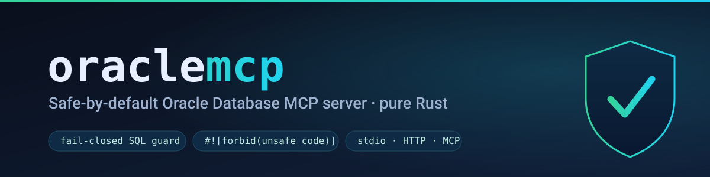

<p align="center">
  
</p>

<p align="center">
  <a href="https://github.com/MuhDur/oraclemcp/actions/workflows/ci.yml"></a>
  <a href="https://crates.io/crates/oraclemcp"></a>
  <a href="#license"></a>
  
  
  
</p>

> **Governed, least-privilege Oracle Database access for AI agents — in pure Rust.**

`oraclemcp` is a [Model Context Protocol](https://modelcontextprotocol.io) server that gives an AI agent governed, least-privilege access to an Oracle database. Every raw statement the agent submits is classified **before** it can reach Oracle: read tools admit only statements *proven* read-only, and non-read SQL runs only through an explicit, profile-gated path that **rolls DML back by default** and requires a preview-derived grant before commit. Session elevation is explicit, temporary, and capped by profile `max_level`. The core is engine-free and `#![forbid(unsafe_code)]`.

> _An independent open-source project; not affiliated with Oracle. For Oracle's own MCP servers, see [oracle/mcp](https://github.com/oracle/mcp)._

### Drivers

oraclemcp connects through its **own mature, pure-Rust Oracle driver** as the **primary** path. The official `oracledb` crate from Oracle — whose crate name we handed to Oracle in a friendly handshake — is currently in **beta**, and therefore ships purely as a bounded, connect-time **fallback** for the rare case something goes awry. No Oracle Instant Client, ODPI-C, or C toolchain is required.

## At a glance

| | |
|---|---|
| **Tools** | **34 governed MCP tools** + 25 compatibility aliases, each with a real JSON Schema and MCP safety hints |
| **Safety** | fail-closed SQL classifier · 4-level ladder `READ_ONLY → READ_WRITE → DDL → ADMIN` · DML rollback-by-default · signed, hash-chained audit |
| **Auth** | username/password over TCP · IAM / OCI ADB token · TLS/TCPS + PEM · Oracle wallet (`cwallet.sso`) |
| **Oracle** | 18c · 21c · 23ai — including governed native **VECTOR** search |
| **Code** | **9 pure-Rust crates + binary** · `#![forbid(unsafe_code)]` · **~3,300 tests** + a differential fuzzer |
| **Transports** | stdio (default) + Streamable HTTP with rustls TLS/mTLS and optional OAuth |

## Quick start

One line installs or updates on macOS and Linux (works pasted in a terminal or in a non-interactive agent run):

```sh
curl -fsSL "https://raw.githubusercontent.com/MuhDur/oraclemcp/main/install.sh?$(date +%s)" | bash
```

It verifies a SHA-256 digest (plus cosign signature/provenance when cosign is present) and installs `oraclemcp` and the short `om` alias into `$HOME/.local`. Also available: **Windows** (`install.ps1`), **Docker** (`ghcr.io/muhdur/oraclemcp:latest`), `cargo binstall oraclemcp`, and Homebrew/winget once those channels resolve. Air-gapped offline install, verification postures, and service install are documented via `bash install.sh --help` and [`docs/`](docs/). No npm/npx channel is offered.

Onboard and connect a client:

```sh
oraclemcp setup --discover           # one READ_ONLY profile per tnsnames.ora entry — consent-gated, no secrets written to disk
oraclemcp doctor                     # offline diagnostics: driver, TNS/wallet, classifier, NLS
oraclemcp serve --profile db_ro --allow-no-auth    # stdio (local dev)
```

Wire it into an MCP client (e.g. Claude Desktop) over stdio:

```json
{
  "mcpServers": {
    "oracle": {
      "command": "oraclemcp",
      "args": ["serve", "--profile", "db_ro", "--allow-no-auth"]
    }
  }
}
```

Or run authenticated HTTP with a shown-once bearer, and open the local dashboard through a secret-free one-time pairing URL:

```sh
oraclemcp --json clients issue --label claude --scope oracle:read
oraclemcp serve --listen 127.0.0.1:7070 --client-credentials --profile db_ro
om dashboard
```

`doctor` output is safe to paste into agent sessions — it omits connect strings, usernames, credential references, passwords, wallet paths, IAM tokens, and server DNs while keeping structured failure classes and ORA codes.

## Why oraclemcp

- **Fail-closed by construction.** A `SELECT` an agent dreams up can never silently become a `DELETE`. Read tools admit only **proven** read-only `SELECT`/`WITH` and dictionary introspection. Non-read execution is isolated in `oracle_execute`, bounded by the profile ceiling, rollback-by-default for DML, and explicit-confirm-before-commit. *Forbidden* constructs (multi-statement batches, string-concat dynamic SQL, an unproven function call inside a SELECT) are rejected before touching Oracle, with a typed envelope and a suggested safe alternative.
- **Agent-first UX.** Every tool ships a real JSON Schema, title, and explicit MCP annotations (`readOnlyHint`, `destructiveHint`, `idempotentHint`, `openWorldHint`). Errors are structured [`ErrorEnvelope`](crates/oraclemcp-error)s with machine-stable classes, fuzzy suggestions, and next-step hints — never bare strings. A zero-arg `oracle_capabilities` tool lets an agent discover the surface.
- **Pure Rust, no `unsafe`.** Every crate is `#![forbid(unsafe_code)]`; the fail-closed classifier is a real `sqlparser` AST classifier and carries a differential cargo-fuzz target.
- **Two transports.** stdio (default) and Streamable HTTP (`--listen`) with fail-closed auth defaults, optional OAuth bearer enforcement, and native rustls TLS/mTLS.

## Safety model

The core invariant is a **fail-closed SQL guard** — not "read-only forever." Operating levels form a ladder, `READ_ONLY < READ_WRITE < DDL < ADMIN`, surfaced through `oracle_execute`, `oracle_compile_object`, `oracle_create_or_replace`, `oracle_patch_source`, and `oracle_set_session_level`. Read-only is the **default** and the cap for unconfigured or `protected` profiles; a profile's `max_level` may permit escalation up to `ADMIN`. Every escalation is guarded:

- a **preview → confirmation-token** step-up before any non-read statement runs,
- a **temporary, TTL-bounded** elevation window,
- the **classifier still gating every statement** at the *current* level,
- **DML rolling back by default**, `protected` profiles pinned at `READ_ONLY` with an immutable ceiling, and OAuth scopes that can only *lower* the effective level,
- a **signed, append-only, HMAC-SHA256 hash-chained audit** record for every privileged action.

An unparseable or unclassifiable statement fails **closed**. Statements can emit a verdict certificate bound to the classified bytes and the audit record; the routine-purity law it relies on is specified in [`proofs/purity-core/PurityCore.lean`](proofs/purity-core/PurityCore.lean) and pinned to the Rust classifier by a conformance test.

## Governed dimensions

A database session is treated as a governed surface with several independent controls, each with an executable proof script:

| Dimension | What it governs | Proof |
|---|---|---|
| **Cost** | per-call `max_query_cost` + durable per-principal budget; over-ceiling estimates refused pre-execution | [`cost_gate.sh`](scripts/e2e/cost_gate.sh) |
| **Time** | `as_of` flashback reads, cross-SCN/cross-DB `oracle_diff`, historical plan timelines | [`time_diff.sh`](scripts/e2e/time_diff.sh) |
| **Egress** | profile-scoped result masking applied before rows leave the server, with mask certificates ([ADR 0008](docs/adr/0008-result-masking-policy.md)) | [`served_egress.sh`](scripts/e2e/served_egress.sh) |
| **Proof** | verdict certificates + async Rekor anchoring of audit heads ([ADR 0010](docs/adr/0010-verdict-certificate-schema.md)) | [`verdict_certificate.sh`](scripts/e2e/verdict_certificate.sh) |
| **Policy** | per-profile deny/narrow-only SQL policy that can tighten but never widen the base classifier ([ADR 0009](docs/adr/0009-policy-as-code-grammar.md)) | [`sql_policy.sh`](scripts/e2e/sql_policy.sh) |
| **Living DB** | CQN change notifications, `oracle_orient` freshness/drift, Arrow IPC output | [`living_db.sh`](scripts/e2e/living_db.sh) |
| **Vector search** | bounded, fail-closed 23ai `oracle_semantic_search` through the full policy/masking/audit path | [`governed_rag.sh`](scripts/e2e/governed_rag.sh) |
| **Fleet** | map or compare several MCP-visible profiles at once; unreachable targets become typed `UNREACHABLE`/`FAIL_CLOSED` lanes | [`fleet.sh`](scripts/e2e/fleet.sh) |
| **Reversible workspace** | native SAVEPOINT checkpoints, held DML, `oracle_undo_to`, undo-aware `oracle_preview_dml` | [`reversible.sh`](scripts/e2e/reversible.sh) |
| **Editions** | edition-based redefinition via an allowlist, persisted proposals, and an `ADMIN`-only merge | [`editions.sh`](scripts/e2e/editions.sh) |
| **Incident capture** | `om incident capture`/`replay` — redacted, deterministic bundles re-classified offline ([ADR 0011](docs/adr/0011-incident-artifact-manifest.md)) | [`incident.sh`](scripts/e2e/incident.sh) |
| **Diagnostics** | `oracle_top_queries` (free `V$SQLSTATS`) and a read-only `oracle_db_health` suite that degrades cleanly on least-privilege accounts ([ADR 0005](docs/adr/0005-awr-diagnostics-license-gating.md)) | version-matrix lanes |

What an agent sees depends on the active level: at `READ_ONLY`, `tools/list` returns the read-safe subset; once elevated within the profile ceiling it returns the full **34 tools + 25 aliases**. A call to a not-yet-visible tool is refused with the same typed `ErrorEnvelope` as any other below-level statement.

## Tools

The tables below are generated from the server's tool registry — the same descriptors `tools/list` serves — by `scripts/docs_generate.sh` (rendered from `oraclemcp robot-docs tools --markdown`). Do not hand-edit them; edit the registry and run `bash scripts/docs_generate.sh --write`.

<!-- generated:tools -->
| Tool | Title | Purpose | Visible from | Destructive |
| --- | --- | --- | --- | --- |
| `oracle_list_profiles` | Oracle List Profiles | List configured connection profiles without exposing connect strings, usernames, or credential references. | `READ_ONLY` | no |
| `oracle_connection_info` | Oracle Connection Info | Describe the active profile and Oracle connection. | `READ_ONLY` | no |
| `oracle_switch_profile` | Oracle Switch Profile | Reconnect this MCP server to another configured profile by name. | `READ_ONLY` | no |
| `oracle_set_session_level` | Oracle Set Session Level | Preview or apply a temporary session operating-level elevation within the active profile ceiling, or drop back to READ_ONLY. | `READ_ONLY` | yes |
| `oracle_query` | Oracle Query | Run a read-only SELECT with positional binds; paginated and row/byte capped. | `READ_ONLY` | no |
| `oracle_semantic_search` | Oracle Semantic Search | Run a bounded, fail-closed 23ai vector search through the same policy, semantic-resolution, masking, and audit path as oracle_query. | `READ_ONLY` | no |
| `oracle_diff` | Oracle Diff | Diff one proven read-only SELECT across two Oracle SCNs, or across two databases. | `READ_ONLY` | no |
| `oracle_preview_sql` | Oracle Preview SQL | Classify a SQL statement and report whether it would pass the active profile/session gate without executing it. | `READ_ONLY` | no |
| `oracle_execute` | Oracle Execute | Execute one non-read SQL statement through the classifier and active profile gate; DML rolls back by default, while commits and non-transactional effects such as sequence NEXTVAL require the confirmation token from oracle_preview_sql. | `READ_WRITE` | yes |
| `oracle_checkpoint` | Oracle Checkpoint | Establish a named checkpoint (a native Oracle SAVEPOINT) on this session, opening the reversible workspace: oracle_execute with hold=true then leaves DML pending instead of rolling it back, and oracle_undo_to walks it back. | `READ_WRITE` | yes |
| `oracle_undo_to` | Oracle Undo To | Undo the reversible workspace: ROLLBACK TO SAVEPOINT <name> discards every held statement executed after that checkpoint and releases the checkpoints stacked above it, leaving the transaction open. | `READ_WRITE` | yes |
| `oracle_preview_dml` | Oracle Preview DML | Dry-run one DML statement: the server brackets it in its own savepoint, executes it, reads the rows it touched, then rolls back to that savepoint and presents the result — nothing is committed and nothing is left behind. | `READ_WRITE` | yes |
| `oracle_compile_object` | Oracle Compile Object | Preview or compile one PL/SQL/view object through the active DDL profile gate; preview is the default and execution requires the returned confirmation token. | `DDL` | yes |
| `oracle_create_or_replace` | Oracle Create Or Replace | Preview or apply one CREATE OR REPLACE statement through the classifier and active DDL profile gate. | `DDL` | yes |
| `oracle_patch_source` | Oracle Patch Source | Preview or apply an exact old_text to new_text replacement against one stored source object; preview refetches the current source and execute uses the existing DDL confirmation gate. | `DDL` | yes |
| `oracle_list_schemas` | Oracle List Schemas | List schemas that own objects visible to this session, optionally filtered by name. | `READ_ONLY` | no |
| `oracle_schema_inspect` | Oracle Schema Inspect | List objects in the current schema, one owner, or all accessible schemas, with optional type/name filters. | `READ_ONLY` | no |
| `oracle_search_objects` | Oracle Search Objects | Unified read-only object search/inspection with a detail_level. | `READ_ONLY` | no |
| `oracle_orient` | Oracle Orient | Return bounded orientation evidence: by default one cacheable snapshot for the active profile; fleet=true maps every MCP-visible profile independently with schema, version, freshness, drift, and typed UNREACHABLE/FAIL_CLOSED lane status. | `READ_ONLY` | no |
| `oracle_describe` | Oracle Describe | Describe a table/view's columns and constraint metadata. | `READ_ONLY` | no |
| `oracle_describe_index` | Oracle Describe Index | Describe one index's metadata, indexed columns, and function-based expressions. | `READ_ONLY` | no |
| `oracle_describe_trigger` | Oracle Describe Trigger | Describe one trigger's timing, event, target table, status, and body. | `READ_ONLY` | no |
| `oracle_describe_view` | Oracle Describe View | Describe one view's definition metadata and columns. | `READ_ONLY` | no |
| `oracle_get_ddl` | Oracle Get DDL | Fetch an object's DDL via DBMS_METADATA.GET_DDL (allowlisted object types). | `READ_ONLY` | no |
| `oracle_get_source` | Oracle Get Source | Fetch an object's full source text or inclusive line range from ALL_SOURCE with a character cap. | `READ_ONLY` | no |
| `oracle_sample_rows` | Oracle Sample Rows | Read the first rows of a table or view with a hard row cap. | `READ_ONLY` | no |
| `oracle_read_clob` | Oracle Read CLOB | Read one CLOB/NCLOB/text value by key with a character cap. | `READ_ONLY` | no |
| `oracle_compile_errors` | Oracle Compile Errors | Retrieve compile errors for the current schema, an owner, or one object (ALL_ERRORS). | `READ_ONLY` | no |
| `oracle_search_source` | Oracle Search Source | Full-text search across ALL_SOURCE for a needle (row- and line-capped). | `READ_ONLY` | no |
| `oracle_plscope_inspect` | Oracle PL/Scope Inspect | Inspect PL/Scope identifier and SQL statement metadata for one PL/SQL object when ALL_IDENTIFIERS/ALL_STATEMENTS are populated. | `READ_ONLY` | no |
| `oracle_explain_plan` | Oracle Explain Plan | Explicit diagnostic-write EXPLAIN PLAN for a vetted SELECT; writes PLAN_TABLE, requires READ_WRITE plus allow_plan_table_write, and is disabled on read-only standby. | `READ_WRITE` | yes |
| `oracle_top_queries` | Oracle Top Queries | Read-only top-SQL ranked by elapsed/CPU/buffer-gets/disk-reads over the free live cursor cache (V$SQLSTATS). | `READ_ONLY` | no |
| `oracle_plan_timeline` | Oracle Plan Timeline | Read-only historical optimizer plan and relative-cost timeline from AWR snapshots for one SQL ID. | `READ_ONLY` | no |
| `oracle_db_health` | Oracle Db Health | Read-only DBA health-check suite. | `READ_ONLY` | no |
<!-- /generated:tools -->

Every advertised tool descriptor includes a human title plus explicit MCP annotations; these hints are advisory for clients, while the fail-closed classifier and operating-level gate remain the enforcement boundary. `oracle_query` and `oracle_explain_plan` also advertise `outputSchema`, and query results keep Oracle `NUMBER` cells as strings by default (opt into `numbers_as_float=true` explicitly). Beyond `tools/*`, `initialize` advertises `resources`, `prompts`, and `completions` (protocol `2025-11-25`): `resources/list` exposes `oracle://capabilities` and `oracle://tools`, and read templates for `oracle://schema/{owner}` and `oracle://object/{owner}/{type}/{name}` route through the same safe dispatch path.

### Compatibility aliases

For migrations from shorter Oracle MCP tool surfaces, the server advertises compatibility aliases that route to the guarded `oracle_*` tools and share their classifier, validation, and operating-level behavior. `execute_approved`, `deploy_ddl`, and `read_patch_preview` are wrappers rather than plain renames.

<!-- generated:tools-aliases -->
| Alias | Routes to |
| --- | --- |
| `current_database` | `oracle_connection_info` |
| `switch_database` | `oracle_switch_profile` |
| `enable_writes` | `oracle_set_session_level` |
| `disable_writes` | `oracle_set_session_level` |
| `query` | `oracle_query` |
| `preview_sql` | `oracle_preview_sql` |
| `execute_approved` | `oracle_execute` |
| `compile_object` | `oracle_compile_object` |
| `compile_with_warnings` | `oracle_compile_object` |
| `create_or_replace` | `oracle_create_or_replace` |
| `patch_package` | `oracle_patch_source` |
| `patch_view` | `oracle_patch_source` |
| `read_patch_preview` | `oracle_patch_source` |
| `deploy_ddl` | `oracle_create_or_replace` |
| `list_objects` | `oracle_schema_inspect` |
| `list_schemas` | `oracle_list_schemas` |
| `get_schema` | `oracle_schema_inspect` |
| `describe_table` | `oracle_describe` |
| `describe_index` | `oracle_describe_index` |
| `describe_trigger` | `oracle_describe_trigger` |
| `describe_view` | `oracle_describe_view` |
| `get_ddl` | `oracle_get_ddl` |
| `get_object_source` | `oracle_get_source` |
| `get_errors` | `oracle_compile_errors` |
| `get_clob` | `oracle_read_clob` |
<!-- /generated:tools-aliases -->

## Configuration

Connection profiles live in `profiles.toml`. **No secrets are written to disk** — credentials are references resolved at runtime through `env:`, `file:`, or `keyring:`. A minimal read-only profile:

```toml
[profiles.db_ro]
connect_string = "//db.example.com:1521/FREEPDB1"
username       = "APP_RO"
credential_ref = "env:ORACLE_APP_PASSWORD"
# default_level defaults to read_only and is the ceiling for this profile;
# set max_level to permit explicit, TTL-bounded elevation up to ADMIN.
```

The full field reference — HTTP TLS/mTLS/OAuth listeners, the signed audit chain, result-masking policy, fleet/monitor profiles, TCPS/wallet and IAM/DRCP/proxy auth, and per-call timeout/SDU budgets — is in **[`docs/configuration.md`](docs/configuration.md)**.

## Documentation

- **[Configuration reference](docs/configuration.md)** — every profile, auth, transport, audit, and masking field.
- **[Operating & deployment](docs/operations.md)** — containerized deployment, least-privilege account, network posture, service management (systemd/launchd/Windows), air-gapped install, and the operator runbook.
- **[TNS discovery onboarding](docs/tns-discovery-onboarding.md)** · **[Toolchain](docs/toolchain.md)** · **[Upgrade runbooks](docs/upgrading-to-0.8.0.md)** and [field-hardening notes](docs/oraclemcp-091-field-hardening-notes.md).
- **Architecture decisions:** [`docs/adr/`](docs/adr/) · **Formal proofs:** [`proofs/purity-core/`](proofs/purity-core/).

## Build from source

This branch is pinned to **`nightly-2026-05-11`** and has no stable MSRV (the pin arrives transitively through `asupersync`, and Windows needs `windows_by_handle`; see [`docs/toolchain.md`](docs/toolchain.md)). Prefer the verified release archive above; build from source only when you intend to:

```sh
rustup toolchain install nightly-2026-05-11 --component rustfmt --component clippy
cargo +nightly-2026-05-11 install oraclemcp
```

Live database access is built in through the pure-Rust thin driver — **no Oracle Instant Client, ODPI-C, or C toolchain**. Optionally set `TNS_ADMIN` for net-service-name connections. An optional `--features plsql-intelligence` build embeds the offline PL/SQL engine (also published as the `:plsql-intelligence-latest` GHCR image).

## License

Licensed under **Apache-2.0 OR MIT**. The Docker image and crates do not redistribute Oracle Instant Client.
